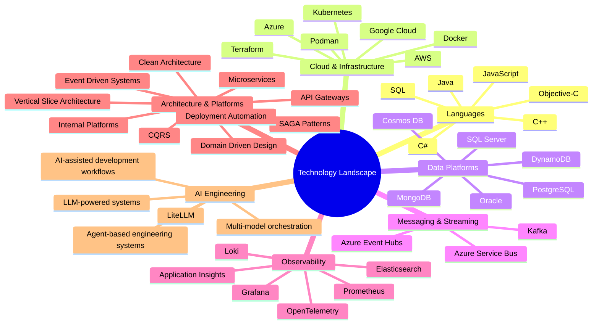
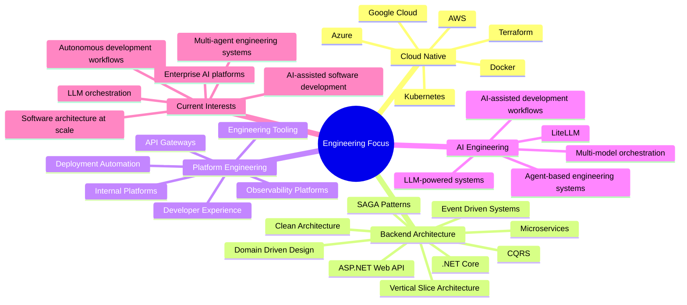
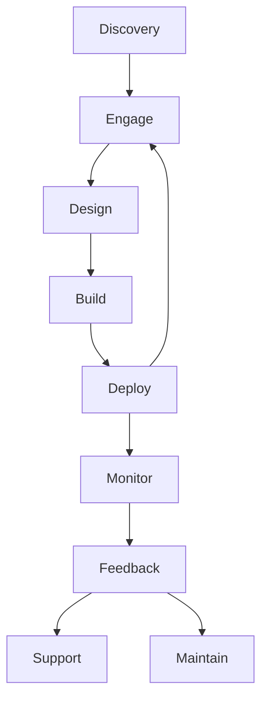

# Hey, I'm Muhammed (Mo) 👋

I've been obsessed with technology for as long as I can remember.

I started out building games, experimenting with graphics engines, mobile apps, and distributed systems, and over the years that curiosity evolved into a passion for solving complex engineering problems at scale. Whether it's processing millions of events a day, designing microservice platforms, building cloud-native systems, creating developer tooling, or experimenting with AI agents, I genuinely enjoy understanding how things work and finding better ways to build them. 

I love projects that sit at the intersection of architecture, performance, automation, and innovation. The kind of projects where there isn't a clear answer, where you have to experiment, challenge assumptions, and create something that didn't exist before.

Some of my favourite work has involved:
- Building highly scalable event-driven systems
- Designing plugin-based and distributed architectures
- Creating developer platforms and internal tooling
- Observability and telemetry engineering
- Real-time communication systems
- AI-powered applications and agentic workflows
- Performance optimisation and large-scale data processing
- Turning complicated business problems into elegant technical solutions

Outside of day-to-day engineering, I enjoy exploring emerging technologies, testing new ideas, and asking "What if?" more often than I probably should. Recently that curiosity has taken me deep into AI, multi-agent systems, autonomous development workflows, and the future of software engineering. 

For me, technology has never been just a career. It's a playground for creativity, problem solving, and continuous learning. Every project is an opportunity to build something useful, learn something new, and push the boundaries a little further.

## What I Do

## What I'm interested in

## Forward Deployed Engineering Lifecycle

## Career Journey

Industries include:

- Banking
- FinTech
- Sports Betting
- Transportation
- Enterprise Software
- Gaming

## Beyond Code

I enjoy solving complex engineering problems, mentoring developers, designing scalable architectures, and exploring how AI can transform the software development lifecycle.

## Connect

- GitHub: https://github.com/mak100186
- LinkedIn: https://www.linkedin.com/in/muhammed-ali-khan-a1a067223/

> Building resilient systems, enabling teams, and pushing the boundaries of modern software engineering.